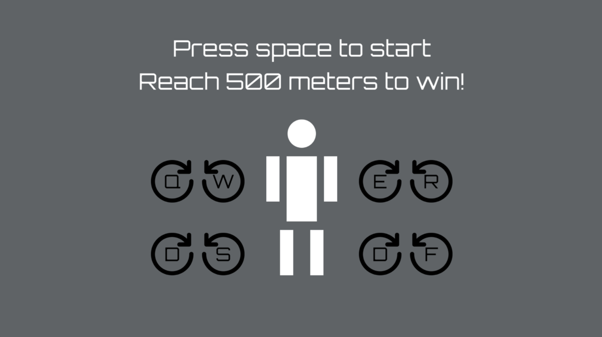
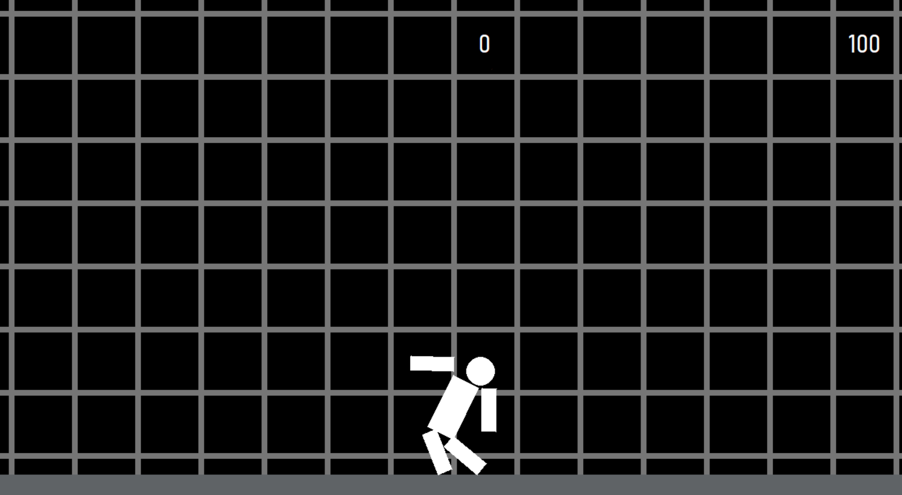

# Walking Game

**Walking Game** is a lightweight 2D side-scrolling platformer developed in Python using the Pygame and Pymunk libraries. The player controls a character by independently moving each of their limbs, using physics-based interaction provided by Pymunk.

## Requirements

- Python 3.x  
- pygame  
- pymunk

You can install the dependencies with:

```bash
pip install pygame pymunk
```

## Project Structure

```
Walking_game/
├── backgrounds/        # background images used in the game
├── ground.py           # module for ground and terrain generation
├── main.py             # main entry point of the game
├── player.py           # module for player movement and physics
├── start_screen.py     # module for the start screen
└── .gitignore
```

## How to Run the Game

```bash
python main.py
```

## Technologies Used

- **Pygame** – for rendering and game loop  
- **Pymunk** – for 2D physics and collision handling

## Screenshots

Example:

<p align="center">
  
  <br>
  
</p>

## License

This project is licensed under the [MIT License](LICENSE).
